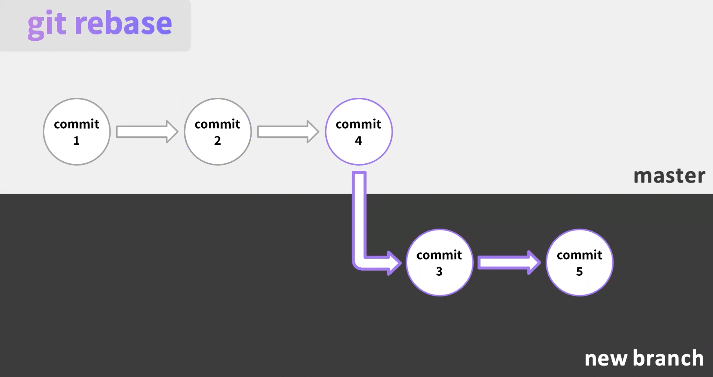

# Git Basics

## Typical Git Usage

1. `git checkout -b DEV-101`: branch off main and create your feature
2. `git add --all`: add the untracked files to your next commit
3. `git commit -m "commit msg"`: create your commit
4. `git push`: push the commit 

Systematically divide up the works with team projects
backend vs frontend vs database etc

`git checkout -b BRANCH_NAME` creates a new branch and checks out the new branch. 

`git branch BRANCH_NAME` creates a new branch but leaves you on the same branch.

## Merging vs. Rebasing

There are two methods for bringing code in from other branches into your own

- merging: combines branches together into a commit
- rebasing: modify, mutate and move commits on your branch

### Merging

`git merge <branch>`

creates a commit which combines the tip of the master branch (HEAD) and the tip of the feature branch into one commit

- this commit is referred to as a "merge commit"
- the merge commit becomes the new HEAD after the merge is complete.

### Rebasing

moves things around, the first commit of feature branch is placed sequentially after the tip of the branch you're rebasing onto.

compares the latest version of main branch and the latest version of feature branch and move them into one linear structure without extra commit. (like linked list)

We want to rebase feature branch INTO main branch not the other way around.

- no extra commit merging the two
- partially rewrites the git history by creating brand new commits for each commit in the master branch
- requires extra step to merge: **rebase feature branch on master, then merge**

  

## How do we undo a commit?

- **reverting**: undoing your changes
- **resetting**: changes the state of head
- **restore**: restore your changes
- **stash**: store your changes for later

## Pull Request

- After pushing your changes into a branch, you create a pull request from your branch into the develop branch.
- Automated checks will run against it informing you of any bugs/errors.
- It can be then reviewed by one or more engineers, where they can provide comments on how to improve it.

